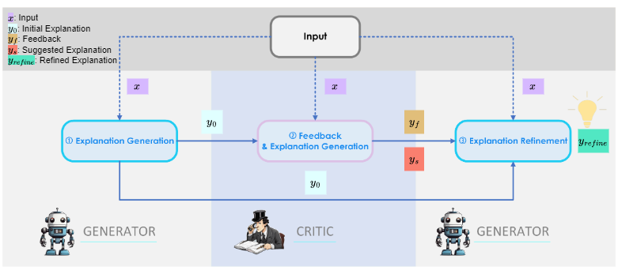
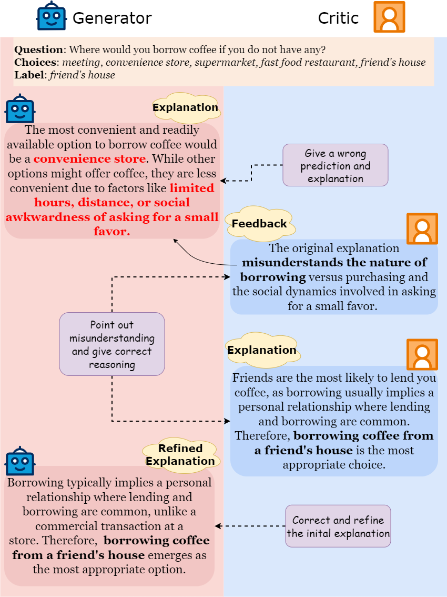

# Cross-Refine: Improving Natural Language Explanation Generation by Learning in Tandem
🍻2024-11-29: Accepted to COLING 2025

🗒️ arXiv link: https://arxiv.org/abs/2409.07123

## ⚓ Pipeline

Cross-Refine has the following pipeline as shown in the figure:
1. The `generator` outputs an initial explanation based on the given input (`experiments/generator_explanation.py`)
   1. The explanation will be judged by LLMs whether it needs to be improved further (`experiments/generator_explanation_evaluation.py`)
2. The `critic` takes the initial explanation and input into account and outputs feedback on the explanation generated by `generator` & suggested explanation (`critic_feedback_explanation_generation.py`)
3. The `generator` gets feedback and suggested explanation from `critic` and use them to refine the initial explanation (`feedback_refinement.py`)

## ⚙️Install the requirements
```bash
python -m pip install --upgrade pip
pip install -r requirements.txt
```

## Example
Here is an example for an instance from ECQA dataset:


## Citation
```
@misc{wang2024crossrefineimprovingnaturallanguage,
      title={Cross-Refine: Improving Natural Language Explanation Generation by Learning in Tandem}, 
      author={Qianli Wang and Tatiana Anikina and Nils Feldhus and Simon Ostermann and Sebastian Möller and Vera Schmitt},
      year={2024},
      eprint={2409.07123},
      archivePrefix={arXiv},
      primaryClass={cs.CL},
      url={https://arxiv.org/abs/2409.07123}, 
}
```